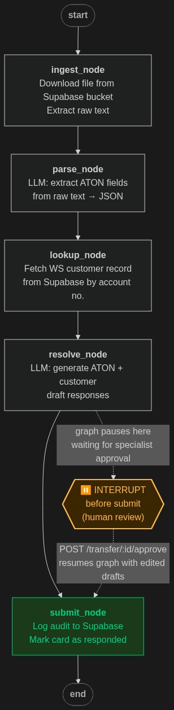

# TransferSimple — ATON Transfer Resolution Platform

TransferSimple is an internal operations tool that automates the resolution of rejected ATON (Account Transfer Online Notification) transfers at Wealthsimple. When a transfer is rejected by the clearinghouse, an ops specialist uploads or triggers a simulation of the source document (email, FAX, or PDF). The AI pipeline parses the rejection, drafts both an institutional response and a plain-language client email, and presents them in a Kanban-style review board. The specialist reviews, edits if needed, and approves — at which point the drafts are logged to audit.

---

## Table of Contents

1. [Architecture Overview](#architecture-overview)
2. [AI Pipeline — LangGraph](#ai-pipeline--langgraph)
3. [Backend — FastAPI](#backend--fastapi)
4. [Frontend — Vue 3 / Vite](#frontend--vue-3--vite)
5. [Kanban Board](#kanban-board)
6. [Rejection Codes & Confidence Scoring](#rejection-codes--confidence-scoring)
7. [LLM Providers](#llm-providers)
8. [Document Extraction](#document-extraction)
9. [Supabase Integration](#supabase-integration)
10. [Real-Time Updates — WebSocket](#real-time-updates--websocket)
11. [Project Structure](#project-structure)
12. [Environment Variables](#environment-variables)
13. [Running Locally](#running-locally)
14. [Simulation Scenarios](#simulation-scenarios)

---

## Architecture Overview

```
┌─────────────────────────────────────────────────────────────────────┐
│                         Browser (Vue 3)                             │
│   Welcome → Kanban Board (Incoming | In Review | Responded)         │
│   Real-time card updates via WebSocket (ws://localhost:8000/ws)     │
└──────────────────────────┬──────────────────────────────────────────┘
                           │ REST + WebSocket
┌──────────────────────────▼──────────────────────────────────────────┐
│                      FastAPI (port 8000)                            │
│   /api/sim/{id}  →  background task  →  LangGraph pipeline          │
│   /api/transfer/{card_id}/move-to-review                            │
│   /api/transfer/{card_id}/approve                                   │
│   /api/transfer/{card_id}/send-aton                                 │
│   /api/transfer/{card_id}/send-customer                             │
└──────────┬───────────────────────────────────────────┬──────────────┘
           │                                           │
┌──────────▼────────────┐                  ┌──────────▼───────────────┐
│   LangGraph Pipeline  │                  │  Supabase (PostgreSQL)   │
│   ingest → parse →    │                  │  • customers table       │
│   lookup → resolve    │                  │  • audit_log table       │
│   [INTERRUPT]         │                  │  • Storage bucket        │
│   submit              │                  │    (sim files)           │
└──────────┬────────────┘                  └──────────────────────────┘
           │
┌──────────▼────────────┐
│   LLM (OpenAI-compat) │
│   Google AI Studio    │
└───────────────────────┘
```

---

## AI Pipeline — LangGraph

The core intelligence is a five-node **LangGraph** state machine. Each node is an `async` function that receives and returns a `GraphState` TypedDict. The graph is checkpointed via an in-memory `MemorySaver` keyed by `card_id`, which allows it to be **interrupted** after `resolve` and **resumed** after human approval.

### Graph Visualization



### Node Descriptions

| Node | Purpose |
|------|---------|
| **ingest** | Downloads the sim file from the Supabase storage bucket. Runs OCR (PNG), PDF extraction, or plain text decode. Stores `raw_text` and a `file_preview_text` (first 4000 chars) in state. |
| **parse** | Sends `raw_text` to the LLM with `PARSE_ATON_PROMPT`. Returns structured JSON: ticket ID, transfer type, rejection codes, client name, SIN, account numbers, institution names, source email/fax. |
| **lookup** | Queries the Supabase `customers` table for the matching Wealthsimple account number. Attaches the full customer record to state. |
| **resolve** | Sends all parsed data + customer summary + code-specific advisory context to the LLM with `RESOLUTION_PROMPT`. Returns two AI-drafted responses and a confidence score. Graph **pauses here** — human review required. |
| **submit** | Resumed after specialist approval. Writes the final approved drafts to the `audit_log` table in Supabase. |

### Interrupt / Resume

```
transfer_graph.astream(initial_state, config)   # runs ingest → parse → lookup → resolve, then pauses

# Human edits drafts in the UI, clicks Approve...

await transfer_graph.aupdate_state(config, {"approved_drafts": {...}})
await transfer_graph.ainvoke(None, config)       # resumes → submit
```

The graph is defined in `backend/app/agents/graph.py` using `StateGraph(GraphState)` with a `compile(checkpointer=memory, interrupt_before=["submit"])`.

---

## Backend — FastAPI

**Entry point:** `backend/app/main.py`  
**Start command:** `uvicorn app.main:app --reload --port 8000`

### Key Dependencies

| Package | Purpose |
|---------|---------|
| `fastapi` | REST API framework |
| `uvicorn` | ASGI server |
| `langgraph` | AI pipeline orchestration (state machine + checkpointing) |
| `langchain-openai` | OpenAI-compatible LLM client (used Google AI Studio) |
| `pydantic` | Request/response schema validation |
| `supabase` | Python client for Supabase database + storage |
| `pdfplumber` | PDF text extraction |
| `pytesseract` | OCR engine wrapper (requires Tesseract-OCR installed) |
| `Pillow` | Image handling for OCR (PNG/JPG FAX documents) |
| `python-dotenv` | `.env` file loading |

### API Endpoints

| Method | Path | Description |
|--------|------|-------------|
| `GET` | `/api/health` | Liveness check — verifies Supabase ping and LLM config |
| `GET` | `/api/transfers` | Returns all current in-memory cards (for page refresh) |
| `DELETE` | `/api/transfers?state=<state>` | Bulk-delete all cards in a column |
| `POST` | `/api/transfers/requeue-review` | Move all In Review cards back to Incoming |
| `POST` | `/api/sim/{sim_id}` | Trigger a simulation run (1–4) |
| `GET` | `/api/transfer/{card_id}` | Get current state of one card |
| `GET` | `/api/transfer/{card_id}/preview-image` | Raw bytes for FAX/PDF file preview |
| `POST` | `/api/transfer/{card_id}/move-to-review` | User-triggered column move Incoming → In Review |
| `POST` | `/api/transfer/{card_id}/approve` | Resume graph with human-approved drafts |
| `POST` | `/api/transfer/{card_id}/send-aton` | Send ATON institution response independently |
| `POST` | `/api/transfer/{card_id}/send-customer` | Send customer response independently |
| `POST` | `/api/transfer/{card_id}/reject` | Discard a pending card |

### Data Models (`backend/app/models/schemas.py`)

```
TransferCard
  ├── card_id           str
  ├── input_type        "Email" | "FAX" | "PDF"
  ├── state             "incoming" | "in_review" | "responded"
  ├── pipeline_status   "incoming" | "aton_ready" | "all_ready" | "responded"
  ├── aton_message      ATONMessage (parsed fields)
  ├── customer          dict (Supabase customer row)
  ├── resolution        Resolution (AI drafts + confidence)
  └── file_preview_text str

Resolution
  ├── aton_response_draft      str   (institutional reply)
  ├── customer_response_draft  str   (plain-language client email)
  ├── confidence_score         float (0.0 – 1.0)
  ├── status                   "pending" | "approved" | "sent"
  ├── aton_sent                bool
  └── customer_sent            bool
```

---

## Frontend — Vue 3 / Vite

**Entry point:** `frontend/src/main.js`  
**Start command:** `npm run dev` (Vite dev server on port 5173)

### Key Dependencies

| Package | Purpose |
|---------|---------|
| `vue` 3 | Reactive UI framework (Composition API + `<script setup>`) |
| `vite` | Build tool / dev server with HMR |
| `pinia` | State management — `useTransferStore` holds all card state |
| `axios` | HTTP client for REST API calls |

### Component Tree

```
App.vue                        — layout shell, toast notifications, health indicator
├── WelcomePage.vue            — intro screen shown before first sim is run
├── SimPanel.vue               — left sidebar: sim trigger buttons (1–4) + clear/requeue controls
└── KanbanBoard.vue            — three-column board
    ├── KanbanColumn.vue       — single column (Incoming / In Review / Responded)
    │   └── TransferCard.vue   — individual card chip with confidence badge + sent indicators
    └── CardModal.vue          — full-screen overlay: ATON fields, customer data, AI drafts, approve/send
        └── ConfidenceBadge.vue — colour-coded score pill (green/amber/red)
```

### State Management (`frontend/src/stores/transfers.js`)

All card data lives in a Pinia store keyed by `card_id`. Cards are upserted on every `card_updated` WebSocket message and removed on `card_removed`. A `card_error` event dispatches a DOM `card-pipeline-error` event which `App.vue` converts into a red error toast.

### API Service (`frontend/src/services/api.js`)

Thin axios wrapper around all backend REST endpoints. Base URL is `http://localhost:8000`.

---

## Kanban Board

The board has three columns reflecting the lifecycle of a transfer:

```
┌─────────────────┬─────────────────┬─────────────────┐
│    INCOMING     │    IN REVIEW    │    RESPONDED    │
│                 │                 │                 │
│  Cards appear   │  Specialist     │  Both responses │
│  here as soon   │  reviews and    │  have been      │
│  as a sim is    │  edits AI       │  approved and   │
│  triggered.     │  drafts.        │  logged.        │
│                 │                 │                 │
│  Pipeline runs  │  Card moved     │                 │
│  in background. │  here manually  │                 │
│  ATON fields    │  by specialist. │                 │
│  appear as      │                 │                 │
│  parsed.        │                 │                 │
└─────────────────┴─────────────────┴─────────────────┘
```

### Card Lifecycle

1. **Sim triggered** → placeholder card immediately appears in Incoming  
2. **After `parse` node** → card updates with ATON fields (ticket ID, rejection codes, client name)  
3. **After `resolve` node** → card updates with AI drafts and confidence badge  
4. **Specialist clicks card** → opens `CardModal`  
5. **Specialist clicks "Move to Review"** → card moves to In Review column  
6. **Specialist reviews/edits drafts, clicks Approve** → graph resumes, audit record written, card moves to Responded

### TransferCard Chip

Each card shows:
- **Input type badge** — `Email` / `FAX` / `PDF`
- **Ticket ID** — parsed from the source document
- **Client name** — legal name on file
- **Rejection codes** — listed inline
- **Confidence badge** — colour-coded pill (green ≥ 75%, amber 50–74%, red < 50%)
- **Sent indicators** — `ATON ○/✓` and `Client ○/✓` showing which responses have been dispatched

### CardModal

Clicking a card opens the full modal with three panels:

**Left panel — Source Document**
- Raw extracted text or embedded image preview (FAX/PDF)
- File type and original filename

**Middle panel — ATON Fields**
- All structured fields parsed by the AI: ticket ID, transfer type, institution names, client name, SIN, account number, rejection codes with descriptions

**Right panel — AI Resolution**
- Confidence badge with score
- Wealthsimple customer data (account types held, values)
- **ATON Response** — editable textarea pre-filled with institutional draft
- **Customer Response** — editable textarea pre-filled with client email draft
- Send buttons for each response independently, or **Approve Both** to finalize

### Toast Notifications

- **Amber toast** — shown for 4 seconds when a card with confidence < 75% is opened in Review
- **Red toast** — shown for 7 seconds if the background pipeline throws an error, displaying the error message

---

## Rejection Codes & Confidence Scoring

Four ATON rejection codes are supported. Each has an associated confidence score representing how safe it is to act on the AI's recommendation without deep manual scrutiny:

| Code | Description | Confidence |
|------|-------------|-----------|
| `CDSX-ATON-NM-001` | Legal name mismatch between delivering and receiving institution records | 0.88 — Low risk, easy to verify |
| `FS-ATON-RA-002` | Registered account type mismatch (e.g. client has no RRSP at Wealthsimple) | 0.75 — Requires ops attention |
| `FS-ATON-IA-003` | Fractional shares detected — in-kind transfer not permitted | 0.55 — Moderate risk, partial liquidation |
| `FS-ATON-MF-004` | Proprietary mutual fund / unsupported asset type | 0.30 — High risk, potential taxable event |

When a transfer has **multiple rejection codes**, the aggregate confidence is the **mean** of all applicable scores. The badge turns red and a low-confidence toast appears if the score drops below 0.75.

---

## LLM Providers

The app supports two interchangeable LLM providers via an `LLM_PROVIDER` environment variable. Both are accessed through the OpenAI-compatible chat completions API using `langchain-openai`'s `ChatOpenAI`.

### Google AI Studio (`LLM_PROVIDER=google`)

Direct access to Gemini models via the `generativelanguage.googleapis.com/v1beta/openai/` endpoint.

> **Thinking models:** Both `gemini-2.5-flash` and `gemini-3-flash-preview` are thinking models that emit `<think>...</think>` reasoning tokens before the JSON output. `_clean_llm_json()` strips these before parsing, and `max_tokens` is set to 16384 to accommodate the thinking budget.

---

## Document Extraction

`backend/app/services/extractor.py` converts raw file bytes into plain text based on file extension:

| Format | Method |
|--------|--------|
| `.txt` | Direct UTF-8 decode |
| `.pdf` | `pdfplumber` — extracts native text layer page by page |
| `.png` / `.jpg` / `.jpeg` / `.tiff` | `pytesseract` OCR with `--oem 3 --psm 6` (single uniform text block) |

Tesseract is auto-detected from common Windows installation paths.

---

## Supabase Integration

`backend/app/services/supabase_client.py` — all operations are async with `asyncio.wait_for` timeouts:

| Operation | Timeout | Description |
|-----------|---------|-------------|
| `ping` | 5s | Health check — verifies connectivity |
| `get_customer_by_ws_account` | 10s | Fetch customer row by 5-digit WS account number |
| `download_sim_file` | 20s | Download sim file bytes from the `clearinghouse-resources` storage bucket |
| `log_audit` | 10s | Write approved transfer record to `audit_log` table |

All failures are caught, logged as warnings, and return `None`/`False` so the pipeline degrades gracefully rather than crashing.

### Database Tables

**`customers`** — Wealthsimple customer records used for resolution context:
```
ws_account_num, first_name, last_name, email, sin, accounts (JSONB)
```

**`audit_log`** — Immutable record of every approved resolution:
```
ticket_id, card_id, action, aton_draft_sent, customer_draft_sent, approved_by, created_at
```

---

## Real-Time Updates — WebSocket

`backend/app/api/websocket.py` — a `ConnectionManager` broadcasts JSON messages to all connected browser clients over `ws://localhost:8000/ws`.

| Event | Payload | When |
|-------|---------|------|
| `card_updated` | `{ card: TransferCard }` | After every pipeline node (parse, resolve, final) and after approve/send |
| `card_removed` | `{ card_id }` | When a card is rejected or cleared |
| `card_error` | `{ card_id, error }` | If the background pipeline task throws an unhandled exception |

The frontend WebSocket handler lives in `frontend/src/services/api.js` and feeds all events into the Pinia store.

---

## Project Structure

```
TransferSimple/
├── README.md
├── graph_visualization.png     ← LangGraph pipeline diagram
├── create_audit_table.sql      ← Supabase schema for audit_log
│
├── backend/
│   ├── .env                    ← environment variables (not committed)
│   ├── requirements.txt
│   └── app/
│       ├── main.py             ← FastAPI app + CORS + router registration
│       ├── config.py           ← .env loader, proxy setup, exported constants
│       ├── agents/
│       │   ├── graph.py        ← StateGraph definition + compile with interrupt
│       │   ├── nodes.py        ← All 5 node functions + GraphState + LLM builder
│       │   └── prompts.py      ← PARSE_ATON_PROMPT and RESOLUTION_PROMPT
│       ├── api/
│       │   ├── routes.py       ← All REST endpoints + _run_graph background task
│       │   └── websocket.py    ← ConnectionManager + /ws endpoint
│       ├── models/
│       │   └── schemas.py      ← Pydantic models: TransferCard, Resolution, ATONMessage
│       └── services/
│           ├── extractor.py        ← Text/OCR extraction
│           ├── rejection_codes.py  ← Code registry + confidence scoring
│           └── supabase_client.py  ← All Supabase operations
│
└── frontend/
    ├── package.json
    ├── vite.config.js
    └── src/
        ├── main.js
        ├── App.vue                 ← Root layout, toasts, health check
        ├── stores/
        │   └── transfers.js        ← Pinia store: card map + WebSocket listener
        ├── services/
        │   └── api.js              ← axios REST wrapper + connectWebSocket()
        └── components/
            ├── WelcomePage.vue     ← Intro screen
            ├── SimPanel.vue        ← Sim trigger buttons + board controls
            ├── KanbanBoard.vue     ← Three-column board container
            ├── KanbanColumn.vue    ← Single column with drop zone
            ├── TransferCard.vue    ← Card chip with badge + sent indicators
            ├── CardModal.vue       ← Full detail overlay + draft editing + approve
            └── ConfidenceBadge.vue ← Colour-coded confidence score pill
```

---

## Environment Variables

Create `backend/.env` with the following:

```dotenv
# ── Supabase ──────────────────────────────────────────────────────────
SUPABASE_URL=https://<project>.supabase.co
SUPABASE_KEY=<publishable anon key>
BUCKET_NAME=clearinghouse-resources

# ── Google AI Studio (OpenAI-compatible) ─────────────────────────────
GOOGLE_API_KEY=<key>
GOOGLE_BASE_URL=https://generativelanguage.googleapis.com/v1beta/openai/
GOOGLE_MODEL_NAME=gemini-2.5-flash
```

---

## Running Locally

### Prerequisites

- Python 3.11+
- Node.js 18+
- [Tesseract-OCR](https://github.com/UB-Mannheim/tesseract/wiki) installed at a standard Windows path (required for FAX sim)

### Backend

```powershell
cd TransferSimple/backend
python -m venv .venv
.venv\Scripts\Activate.ps1
pip install -r requirements.txt
uvicorn app.main:app --reload --port 8000
```

### Frontend

```powershell
cd TransferSimple/frontend
npm install
npm run dev
```

Open **http://localhost:5173** in your browser.

---

## Simulation Scenarios

Four pre-loaded simulation scenarios exercise different input types and rejection code combinations:

| Sim | File(s) | Input Type(s) | Rejection Codes | Notes |
|-----|---------|---------------|-----------------|-------|
| **Sim 1** | `sim_1_email.txt` | Email | `CDSX-ATON-NM-001` | Name mismatch — high confidence (0.88) |
| **Sim 2** | `sim_2_FAX.png` | FAX | `FS-ATON-IA-003` | Fractional shares — OCR required, medium confidence (0.55) |
| **Sim 3** | `sim_3_PDF.pdf` | PDF | `FS-ATON-MF-004` | Proprietary fund — low confidence (0.30), triggers amber toast |
| **Sim 4** | `sim_4_email.txt`, `sim_4_FAX.png`, `sim_4_PDF.pdf` | Email + FAX + PDF | `FS-ATON-RA-002` + `FS-ATON-MF-004` | Three cards generated; FHSA mismatch + proprietary fund — lowest confidence (0.525 mean) |

Sim files are stored as objects in the `clearinghouse-resources` Supabase storage bucket and downloaded at runtime by the `ingest` node.
